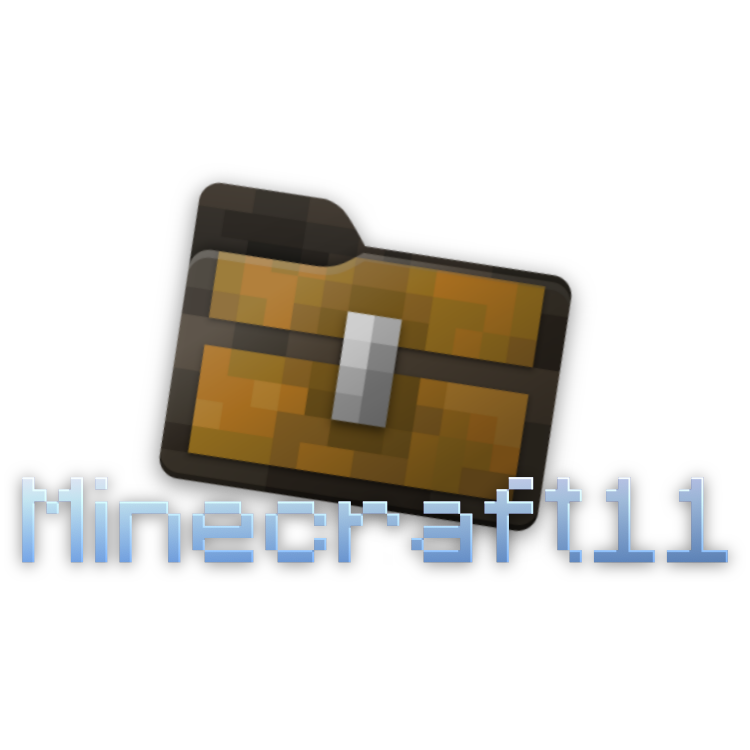
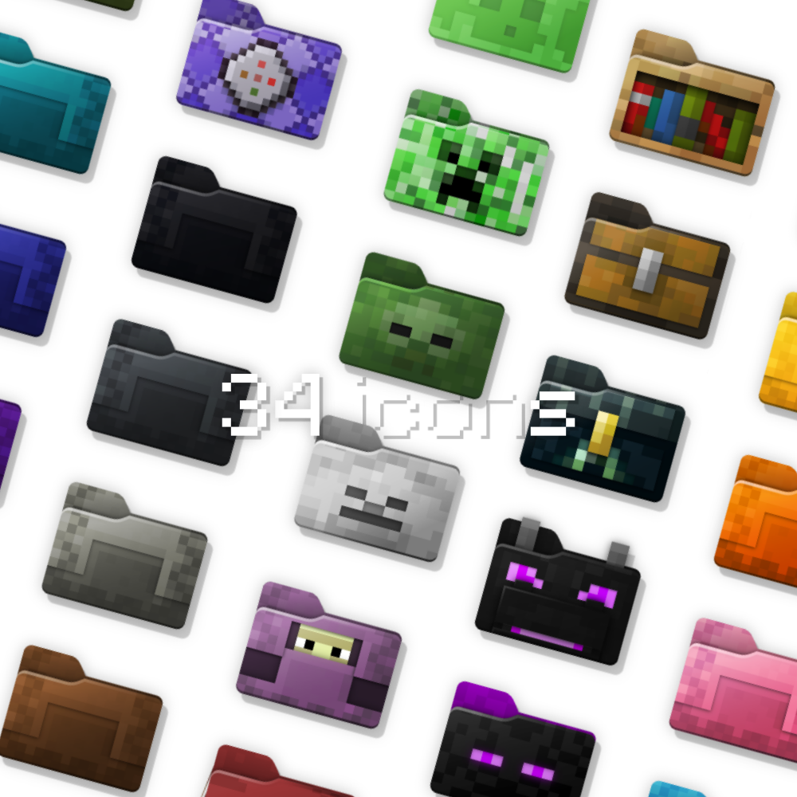

  

  

Custom folder icons for Windows 11 featuring Minecraft mobs and blocks.

Both `.svg` and `.ico` files are provided. I design these icons in Inkscape, so the SVGs are meant to be viewed and edited in Inkscape!

Inspired by [davidvkimball's icons](https://www.deviantart.com/davidvkimball/art/885700560) and the [Folder11](https://github.com/icon11-community/Folder11) collection.

## Template

There's also a pixel-perfect blank folder template called `template.svg` to create your own icons. Feel free to use it and contribute to this collection 🙂
