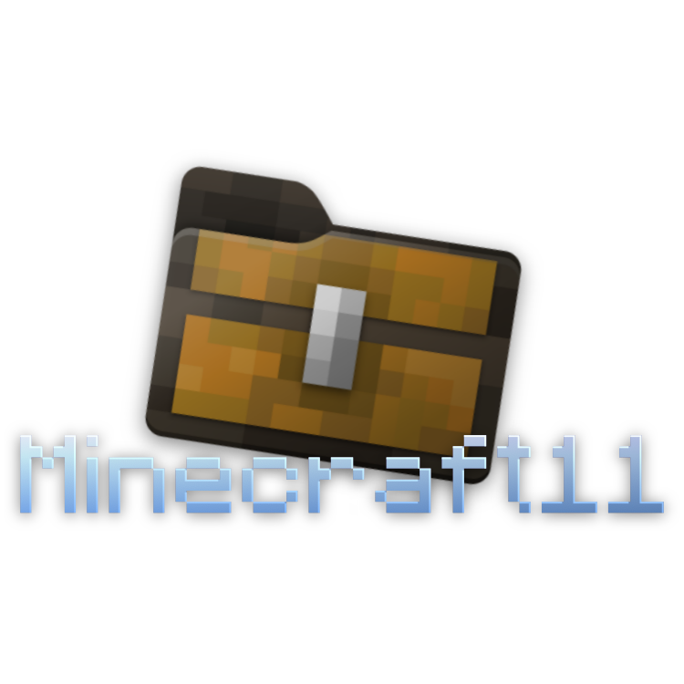
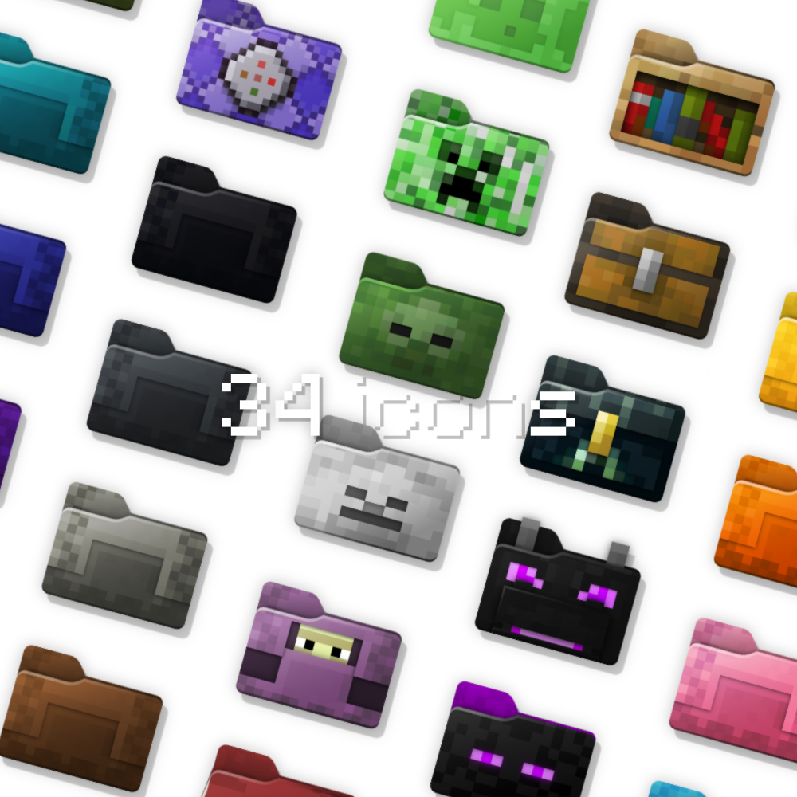

  

    
🌐 Language

    

      

        <a href="https://openaitx.github.io/view.html?user=dalps&project=minecraft11&lang=en">English</a>
        | <a href="https://openaitx.github.io/view.html?user=dalps&project=minecraft11&lang=zh-CN">简体中文</a>
        | <a href="https://openaitx.github.io/view.html?user=dalps&project=minecraft11&lang=zh-TW">繁體中文</a>
        | <a href="https://openaitx.github.io/view.html?user=dalps&project=minecraft11&lang=ja">日本語</a>
        | <a href="https://openaitx.github.io/view.html?user=dalps&project=minecraft11&lang=ko">한국어</a>
        | <a href="https://openaitx.github.io/view.html?user=dalps&project=minecraft11&lang=hi">हिन्दी</a>
        | <a href="https://openaitx.github.io/view.html?user=dalps&project=minecraft11&lang=th">ไทย</a>
        | <a href="https://openaitx.github.io/view.html?user=dalps&project=minecraft11&lang=fr">Français</a>
        | <a href="https://openaitx.github.io/view.html?user=dalps&project=minecraft11&lang=de">Deutsch</a>
        | <a href="https://openaitx.github.io/view.html?user=dalps&project=minecraft11&lang=es">Español</a>
        | <a href="https://openaitx.github.io/view.html?user=dalps&project=minecraft11&lang=it">Italiano</a>
        | <a href="https://openaitx.github.io/view.html?user=dalps&project=minecraft11&lang=ru">Русский</a>
        | <a href="https://openaitx.github.io/view.html?user=dalps&project=minecraft11&lang=pt">Português</a>
        | <a href="https://openaitx.github.io/view.html?user=dalps&project=minecraft11&lang=nl">Nederlands</a>
        | <a href="https://openaitx.github.io/view.html?user=dalps&project=minecraft11&lang=pl">Polski</a>
        | <a href="https://openaitx.github.io/view.html?user=dalps&project=minecraft11&lang=ar">العربية</a>
        | <a href="https://openaitx.github.io/view.html?user=dalps&project=minecraft11&lang=fa">فارسی</a>
        | <a href="https://openaitx.github.io/view.html?user=dalps&project=minecraft11&lang=tr">Türkçe</a>
        | <a href="https://openaitx.github.io/view.html?user=dalps&project=minecraft11&lang=vi">Tiếng Việt</a>
        | <a href="https://openaitx.github.io/view.html?user=dalps&project=minecraft11&lang=id">Bahasa Indonesia</a>
        | <a href="https://openaitx.github.io/view.html?user=dalps&project=minecraft11&lang=as">অসমীয়া</
      

    

  

  

  <a href="https://m11.dalp.sh">View the icons on the website!</a>

  
  &nbsp;&nbsp;
  

> [!IMPORTANT]
> NOT an official Minecraft product.
> 
> These icons are by no means official, approved nor endorsed by Mojang.
> 
> All the textures used in these icons belong to them.

# Minecraft11

Minecraft11 is a fun and free collection of folder icons for Windows 11 featuring Minecraft mobs and blocks. 

  

Both `.svg` and `.ico` files are provided. You only need the contents of the [ico folder](ico/) ([icns folder](icns/) for MacOS users) if you want to use the icons in your file explorer.

If you're interested in editing the icon vectors, make sure to use [Inkscape](https://inkscape.org/).

This rather silly project was inspired by [davidvkimball's icons](https://www.deviantart.com/davidvkimball/art/885700560) and the [Folder11](https://github.com/icon11-community/Folder11) collection.

## Cool! How do I install them?

On Windows, it goes something like this:

1. Clone the repository or download it as a zip archive (big bright green "Code" button at the top of the page > Download ZIP)
2. Extract the `ico` folder somewhere safe, for example your home or your desktop. Remember this location! 
3. Right click on a folder you want to customize
4. Properties > Customize > Change Icon > Browse > Select an .ico file from the aforementioned location
5. Done, you should see the folder icon changed!

## Make your own icons!

There's also a pixel-perfect [blank folder template](template.svg) I cobbled together as a base for the icons. Feel free to use it, contributions are also welcome 🙂
