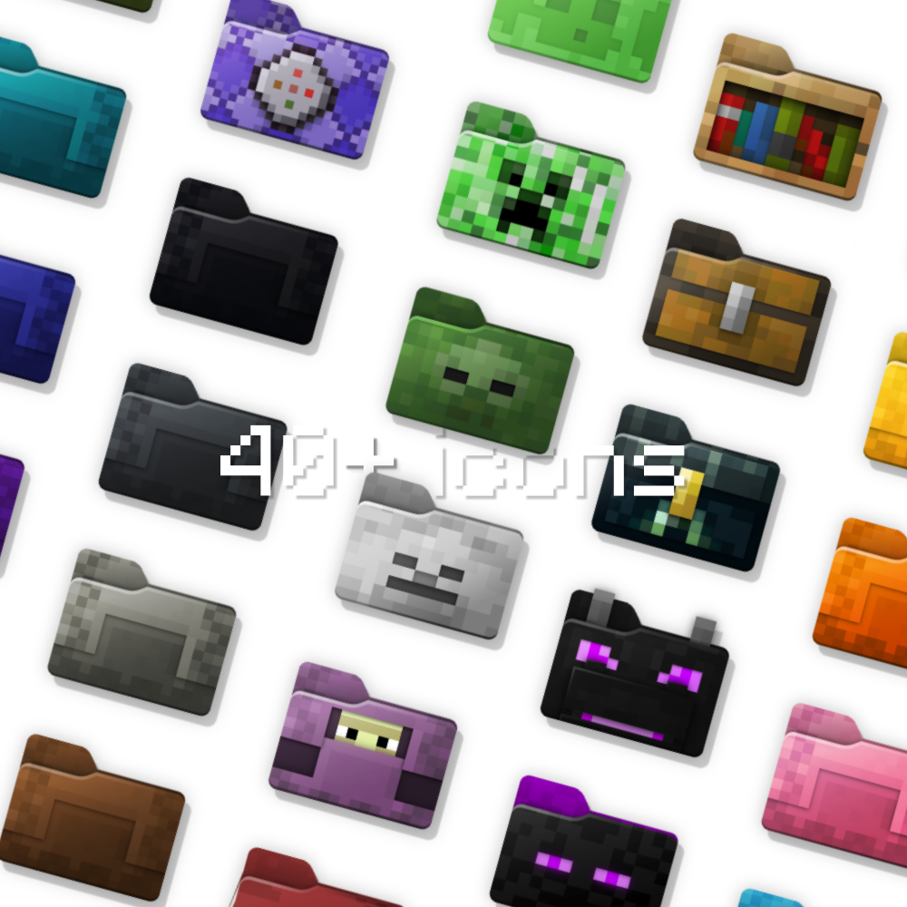

  

  

# Minecraft11

This is a collection of custom folder icons for Windows 11 featuring Minecraft mobs and blocks.

Both `.svg` and `.ico` files are provided. You only need the contents of the `ico` folder if you want to use the icons in your file explorer.

If you're interested in editing the icons' vectors, make sure to use [Inkscape](https://inkscape.org/).

Inspired by [davidvkimball's icons](https://www.deviantart.com/davidvkimball/art/885700560) and the [Folder11](https://github.com/icon11-community/Folder11) collection.

## Cool! How do I install them?

On Windows, it goes something like this:

1. Clone the repository or download it as a zip archive (big bright green "Code" button at the top of the page > Download ZIP)
2. Extract the `ico` folder somewhere safe, for example your home or your desktop. Remember this location! 
3. Right click on a folder you want to customize
4. Properties > Customize > Change Icon > Browse > Select an .ico file from the aforementioned location
5. Done, you should see the folder icon changed!

## Make your own icons!

There's also a pixel-perfect blank folder template called `template.svg` to create your own icons. Feel free to use it and - if you please 🙂 - contribute to this collection.
